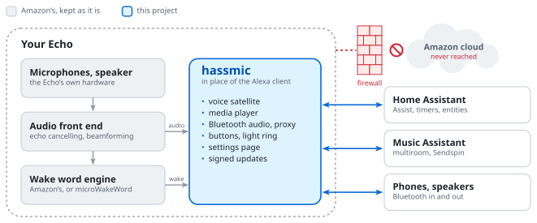
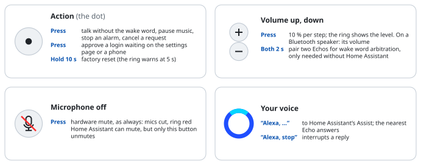
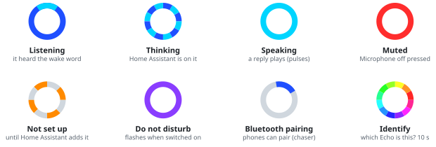
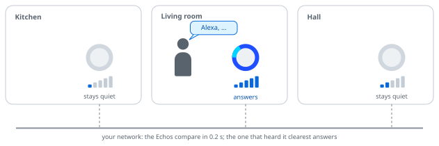
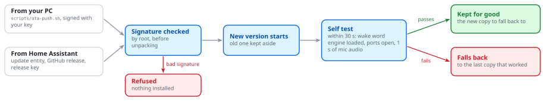

# echo-dot-assist

**Turn an old Amazon Echo into a Home Assistant voice satellite that never talks to Amazon.**

The Echo keeps what it is good at: Amazon's microphone processing and wake word engine, so it still hears you across
the room and over its own music. Only Alexa goes. In its place runs `hassmic`, a small daemon that Home Assistant finds
as an ESPHome device, with no YAML and no add-on.

<picture>
  <source media="(prefers-color-scheme: dark)" srcset="docs/img/overview-dark.svg">
  
</picture>

> [!CAUTION]
> **Vibecoded, unaudited, your risk.** Code, notes and docs were written by an AI (Claude) in conversation with the
> author, and tried on one Echo of each model. The install unlocks the bootloader and writes the system partition: it
> can brick the Echo. A mistake in the firewall or the updates could leave it online or open on your network. Read
> what you run. No warranty, no support.

## Supported Echos

|    | Echo                         | Model  | Codename                                 | Way in                                           |
|----|------------------------------|--------|------------------------------------------|--------------------------------------------------|
| ✅ | Echo Dot 3rd gen (2018)      | D9N29T | [`donut`](devices/donut/README.md)       | open the case, wires on test pads                |
| ✅ | Echo Dot 2nd gen (2016)      | RS03QR | [`biscuit`](devices/biscuit/README.md)   | micro-USB, no soldering                          |
| ✅ | Echo 2nd gen (2017)          | XC56PY | [`radar`](devices/radar/README.md)       | open the case, solder USB to the amplifier board |
| ❌ | Echo Dot 3rd gen (2019–2020) | C78MP8 | `crumpet`                                | the Dot 3 unlock does not work on it             |
| ❌ | Echo Dot 3rd gen with clock  | 36EBT3 | `doebrite`                               | thought to be `crumpet` hardware                 |
| ❌ | Echo Show 5 1st gen (2019)   | H23K37 | [`checkers`](devices/checkers/README.md) | no unlock known                                  |

Each model needs exactly the firmware its page names (`donut`: Fire OS 6574.1 only). Another model? What is known and
how to add one: [`devices/`](devices/README.md).

## What you get

|                                         | Stock Alexa                    | With hassmic                                          |
|-----------------------------------------|--------------------------------|-------------------------------------------------------|
| Voice assistant                         | Alexa, in Amazon's cloud       | Home Assistant Assist                                 |
| Hears you across the room, over music   | ✅                             | ✅ the same front end                                 |
| Wake words                              | Alexa, Echo, Computer, …       | the same, or [any microWakeWord or openWakeWord model](docs/GUIDE.md#wake-word) |
| Only the nearest Echo answers           | ✅ decided in the cloud        | ✅ decided on your network                            |
| Timers, announcements, follow-ups       | ✅                             | ✅                                                    |
| Drop In between Echos                   | ✅ through Amazon              | ✅ [on your network](docs/GUIDE.md#drop-in)           |
| Multiroom music                         | Amazon speaker groups          | [Music Assistant](docs/GUIDE.md#music) (Sendspin)     |
| Bluetooth speaker for your phone        | SBC                            | SBC, AAC, aptX, aptX HD                               |
| Plays on a Bluetooth speaker            | ✅                             | ✅                                                    |
| Bluetooth proxy for Home Assistant      | –                              | ✅                                                    |
| Do not disturb, equalizer, ring brightness | Alexa app                   | [entities in Home Assistant](docs/GUIDE.md#in-home-assistant) |
| Sound detection (smoke alarm, glass, …) | Alexa Guard, checked in the cloud | [on the Echo](docs/GUIDE.md#sound-detection), less reliable |
| Whisper detection                       | answers in a whisper           | [a sensor](docs/GUIDE.md#whisper-detection) for your conversation agent |
| Motion sensor                           | –                              | [from the Wi-Fi signal](docs/GUIDE.md#wi-fi-motion), experimental |
| Wi-Fi setup from a phone                | Alexa app                      | [Home Assistant app](docs/GUIDE.md#setting-up-from-a-phone) |
| Talks to Amazon                         | always                         | **never** (firewalled)                                |
| Updates                                 | from Amazon, automatic         | [signed](#updating): from your PC, or from Home Assistant |

The table is for the ESPHome mode (the default). The Echo can be a Wyoming satellite instead: voice, wake word,
buttons and Music Assistant work, most of the rest does not ([details](docs/GUIDE.md#esphome-or-wyoming)).

## On the Echo

<picture>
  <source media="(prefers-color-scheme: dark)" srcset="docs/img/buttons-dark.svg">
  
</picture>

The light ring speaks stock Alexa's language:

<picture>
  <source media="(prefers-color-scheme: dark)" srcset="docs/img/ring-dark.svg">
  
</picture>

With several Echos, all of them hear you, but only one answers. They settle it among themselves, without Home
Assistant and without a cloud; nothing to set up ([how](docs/GUIDE.md#several-echos)).

<picture>
  <source media="(prefers-color-scheme: dark)" srcset="docs/img/arbitration-dark.svg">
  
</picture>

Everything else is set on the Echo's own **settings page**, `http://<echo-ip>:28931/` ("Visit" on its device page in
Home Assistant): every setting with what it does, the features to switch on and the entities each adds, other Echos to
copy settings and wake words to, the log. A press of the action button lets your browser in. [More](docs/GUIDE.md#settings-page).

## Requirements

- A [supported Echo](#supported-echos), and a USB way into it (its page says what: a cable, or wires).
- A **Linux PC** with `adb`, `fastboot`, `python3`, `make`, `unzip`, `debugfs` (e2fsprogs), `sqlite3`, ~5 GB free disk.
  The setup offers to install what is missing.
- **Home Assistant** with a working Assist pipeline (speech to text, conversation agent, text to speech). Try it in the
  app first. Optional: Music Assistant (tested with 2.10.4).
- **Wi-Fi** with a WPA2 password or none (no captive portal, no enterprise login) that reaches Home Assistant.

## Install

```sh
scripts/setup.sh
```

<picture>
  <source media="(prefers-color-scheme: dark)" srcset="docs/img/install-dark.svg">
  
</picture>

One guided run for every supported model. It does everything itself and stops only when you have to act: download a
file (it picks it up from `~/Downloads`), plug a cable or solder, hold a button, type the Wi-Fi password. It wipes the
Echo, so it asks for a typed `yes` first.

- **Stopped?** Ctrl-C any time; the next run continues where it left off. When a step fails it shows why and offers to
  try again (full output in `build/<codename>/setup.log`).
- **Nothing to compile** on a commit GitHub has built (every push to `main` and `release`): the setup takes that build,
  checked against the project's key, and skips the 1 GB Android NDK.
- **Already rooted** on the right firmware? It offers a shortcut: no unlock, no wipe.
- **More Echos**: `--restart` starts over for the next one, `--preset hassmic-settings.conf` gives it the settings
  exported from another.
- `--dry-run` shows every command without running one; `--from <step>` skips ahead.
- **Back up `secrets/update.key`**, made by the setup: it signs your updates and opens adb over Wi-Fi without Home
  Assistant.

The steps by hand, and what to solder: each model's page in [Supported Echos](#supported-echos).

Once the Echo is on your network, Home Assistant discovers it: add it, pick an Assist pipeline, say "Alexa". The Echo
names itself after its model and MAC address ("Echo Dot 3 5695c4"); give it your name in Home Assistant.

## Updating

<picture>
  <source media="(prefers-color-scheme: dark)" srcset="docs/img/update-dark.svg">
  
</picture>

- **From Home Assistant**: pick a channel under "Online updates" on the settings page. `release` gets releases (the
  `release` branch), `beta` also every build of `main` that changes the Echo's software, `off` (the default) nothing.
  The Echo's firmware entity then shows new versions and installs them. ESPHome mode only.
- **From your PC**: `git pull`, then `scripts/ota-push.sh <echo-ip>` (it remembers the address). It builds, or takes
  that commit's build from GitHub as the setup does, signs with your `secrets/update.key` and pushes over Wi-Fi
  (TCP 28929).

Either way a broken update cannot strand the Echo: until a new version has passed its self test, the Echo falls back
to the last one that worked. What changed: [CHANGELOG.md](CHANGELOG.md). What online updates trust:
[security](docs/SECURITY.md#updates).

## When something is wrong

The settings page's **Log** (System section) shows what the Echo did; over adb it is
`adb shell tail -30 /data/local/hassmic/boot.log`. Lines start with UTC once the Echo has the time from Home Assistant
(the page shows your time zone), `boot+<seconds>` before that: behind the firewall only Home Assistant sets the clock,
on connecting and every 6 hours.

<details>
<summary><b>The wake word and the button do nothing</b></summary>

Most likely no connection to Home Assistant; the Echo does not show that yet. In the log, `wake: ALEXA type=2` means it
heard you, `client connected` / `voice assistant: subscribed` means Home Assistant is there. Nothing after the last
`client disconnected`: check the Echo's address (`adb shell ifconfig wlan0`), that Home Assistant reaches it (TCP
26053) and the Echo reaches Home Assistant (8123). Keep exactly one Wi-Fi profile on the Echo.
</details>

<details>
<summary><b>No sound from replies or music</b></summary>

The Echo fetches every reply, announcement and `play_media` from the URL Home Assistant or Music Assistant gives it.
Home Assistant builds it from its internal URL (Settings › System › Network), or its LAN IP. The Echo must resolve
that name (DNS from DHCP; `.local` works) and reach the address: on a network without internet, a URL inside it. The log says what
failed (`net: cannot ...`). No button sounds either? Check the volume.
</details>

<details>
<summary><b>"Invalid encryption key" in Home Assistant</b></summary>

After a reset of the Echo, or when something else set a key first:

`scripts/adb-wifi.sh <echo-ip>`, then `adb shell rm /data/local/hassmic/state/api_key`, reboot the Echo, delete the
device in Home Assistant and add it again.
</details>

Open issues and measurements: [PLAN.md](PLAN.md).

## Undo it

- **For now**: `adb shell rm /data/local/hassmic/hassmic.conf`, reboot. A stock, unregistered Echo, which updates itself
  if it gets internet.
- **For good**: `scripts/install-system.sh --uninstall`.
- **All of it**: reflash the stock firmware from TWRP, step 1 of the model's page.
- **Start over** but keep the install: [factory reset](docs/GUIDE.md#factory-reset) (hold the action button 10 s).

## Security

No cloud: the firewall lets Amazon's programs reach only your local network, and firmware updates never get out. The
link to Home Assistant is encrypted with a key Home Assistant sets; until you add the Echo, anyone on the network can connect.
The settings page lets in only browsers you approved with the action button. adb is closed over Wi-Fi. Updates
install only with a valid signature. The whole model, including what it does not protect against:
[docs/SECURITY.md](docs/SECURITY.md).

## More

- [User guide](docs/GUIDE.md): every feature and setting in detail.
- [DEVELOPMENT.md](DEVELOPMENT.md): how it works, building, tests, contributing.
- [docs/](docs/): what was found taking the Echo apart.

## Licence

[MIT](LICENSE), for everything written here. `src/third_party/` keeps its own licences, stated in each file: monocypher
(BSD-2-Clause OR CC0-1.0), `dr_flac.h` (public domain or MIT-0), `minimp3.h` (CC0-1.0), `rnnoise/` (BSD-3-Clause,
`COPYING` beside it), `freeaptx.c`/`.h` (LGPL-2.1-or-later; linked statically, and everything needed to rebuild and
relink it is in this repository).

Nothing of Amazon's is in this repository or covered by this licence: firmware, libraries and wake word models come
from your own device and stay Amazon's. Not affiliated with or endorsed by Amazon, Home Assistant or Music Assistant;
"Alexa" and "Echo" are Amazon's trademarks.
